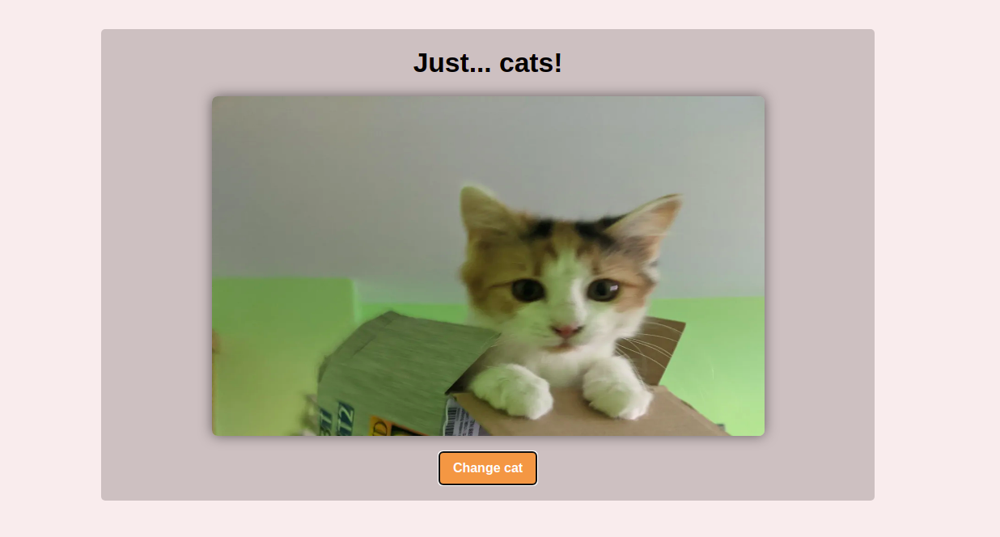

<h1 align="center">Javascript Assíncrono</h1>

## 💻 Projeto

Este projeto contém a atividade prática do Curso "Javascript Assíncrono", que faz parte do Bootcamp-Inter-Frontend-Developer

 

## 🏋️‍♀️ Atividade: API "catAPI"

Nesta atividade, vamos criar uma página que carrega fotos aleatórias de gatinhos sempre que clicamos em um botão.

- Utilize a API `https://thatcopy.pw/catapi/rest/` para fazer as chamadas com o método `fetch()`;

- Utilize seus conhecimentos na manipulação do DOM para criar a imagem e ativar o evento de clique do botão!

 

 

## 🚀 Tecnologias

- HTML
- CSS
- Javascript
