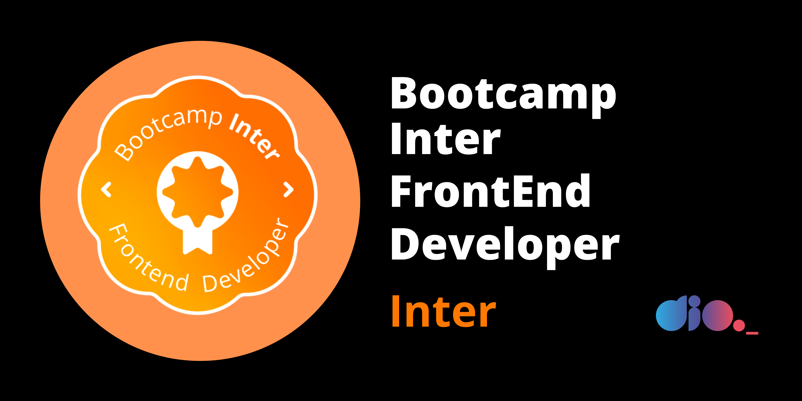

<h1 align="center">
    
     Bootcamp Inter Frontend Developer 
</h1>

## 💻 Projeto

O Projeto **Bootcamp Inter Frontend Developer** é um repositório para estudos, anotações e desafios que ocorrem na Bootcamp.

 

    

 

## 🚀 Desafios

1 - [Github-primeiro-repositório](01-desafio-github-primeiro-repositorio)

2 - [Introdução-ao-javascript-desafios-de-projetos](2-introduçao-ao-javascript-desafios-de-projetos)
